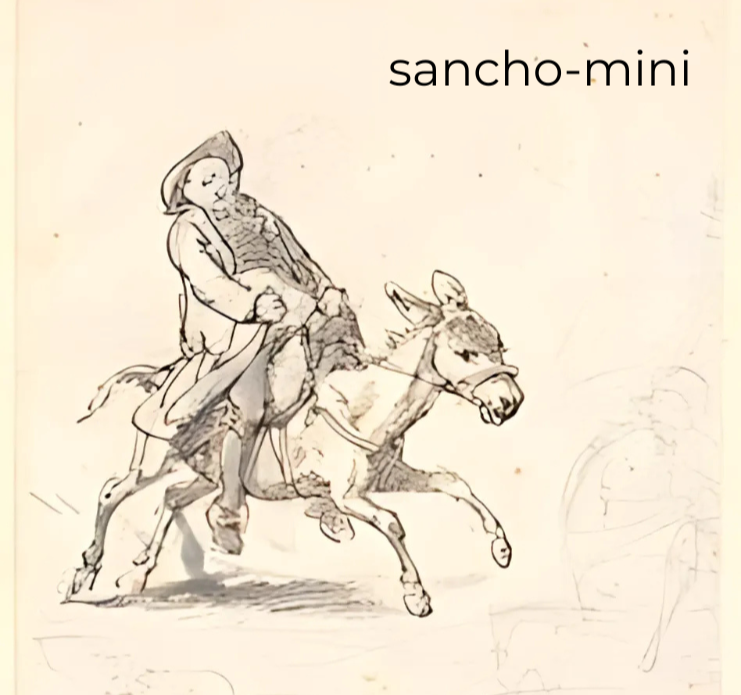
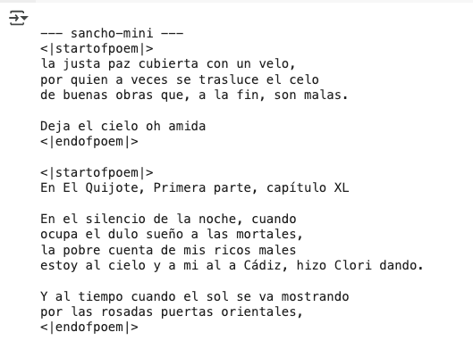

# Construyamos-GPT

Esta guía tiene como objetivo permitiros no solo entender cómo se construye un GPT sino también construir uno desde 0, desde cómo conseguimos que lea nuestro texto hasta cómo hacemos que deje de generar texto.

El proyecto está creado de forma que podréis hacerlo todo incluso sin saber programar y sin ninguna experiencia previa. El objetivo principal es entender en su completitud cómo está construido un GPT, podréis construirlo vosotros mismos si queréis también, y tampoco hacen falta conocimientos técnicos previos.

En el contenido anglosajón se suele entrenar pequeños modelos usando al autor inglés más famoso, **Shakespeare**, así que como esto es una guía en español, nosotros crearemos nuestro GPT usando al autor español más famoso, **Cervantes**, y crearemos desde 0 un GPT llamado '***sancho-mini***', con el objetivo de que logre escribir poesía Cervantina sobre el Quijote.

<table align="center">
  <tr>
    <td></td>
    <td></td>
  </tr>
  <tr>
    <td colspan="2" align="center"><i>Texto generado por **sancho-mini**</i></td>
  </tr>
</table>
___


```

```

Está disponible también a través del siguiente enlace.