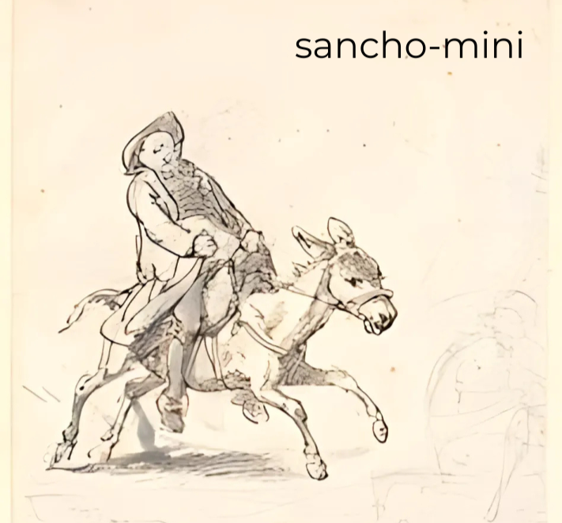

# Construyamos-GPT

Esta guía tiene como objetivo permitiros no solo entender cómo se construye un GPT sino también construir uno desde 0, desde cómo conseguimos que lea nuestro texto hasta cómo determinamos cuándo debe de terminar de generar texto, todo se cubre dentro.




Está estructurada de la siguiente manera
```

```

Está disponible también a través del siguiente enlace.