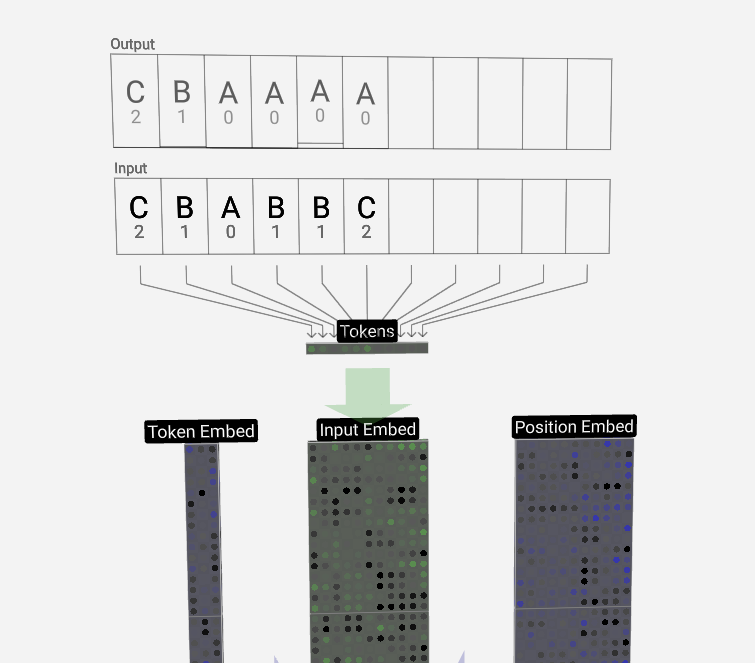

# Parte 2: Tokens

Si bien un GPT puede llegar a parecer complejo, hay una idea muy simple por detrás, justo a su inicio, que es la que vamos a explorar en esta parte: ***los Tokens***.

Los tokens le permitirán trabajar con texto humano a nuestro GPT, y llegar a entenderlo, y nos sirven porque estos modeloe en realidad no 

 

  

<i><b>Tokens </b> entrando en un GPT.</i>

