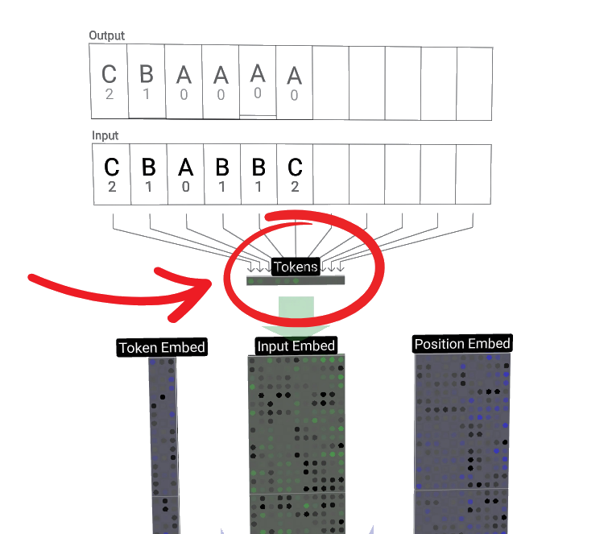
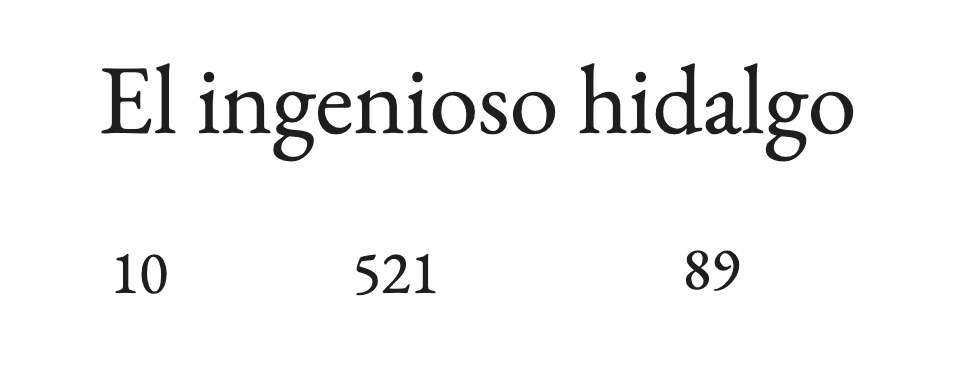

# Parte 2: Tokens

Si bien un GPT puede llegar a parecer complejo, hay una idea muy simple por detrás, justo a su inicio, que es la que vamos a explorar en esta parte: ***los Tokens***.

 

  

<i><b>Tokens </b> entrando en un GPT.</i>

Los tokens le permitirán trabajar con texto humano a nuestro GPT, y llegar a entenderlo, y nos sirven porque estos modelos en realidad no entienden el texto como nosotros. De hecho, si lo piensas, nosotros tampoco entendemos un carácter por sí solo, a su nivel más fundamental.

Un carácter, como la letra 'A' que ves en una pantalla o en un cubo cuando aprendíamos a leer, no es más que un montón de partículas agrupadas, átomos organizados de una forma muy concreta. A ese nivel, al nivel de los quarks que componen esos átomos, no hay ninguna diferencia real entre una silla, un carácter chino o la letra 'A' impresa en un bloque de madera. No tienen un significado intrínseco, y somos nosotros, los humanos, los que les asignamos un significado a través de un ***vocabulario***.

 

  

<i>Imagen atómica de alta resolución (lo que veríamos tanto en el carácter 'A' como en una silla).</i>

 

Es decir, en nuestro vocabulario tenemos palabras como 'casa', 'rojo' o 'sol', y sabemos qué significan, por lo que tenemos que encontrar una forma de darle a nuestro modelo de IA su propio vocabulario y, además, dárselo en un formato que pueda procesar internamente. 

Y es aquí donde entra la primera pieza clave para pensar en qué debemos hacer con nuestros caracteres: las redes neuronales operan internamente con números, con grandes matrices y operaciones matemáticas, así que necesitamos transformar nuestro lenguaje a un formato numérico.

Este proceso de conversión se llama ***tokenización***.

 

  

<i>Sin formato numérico, no podríamos realizar ninguna operación.</i>

 

## ¿Cómo convertimos texto en números?

Existen varias estrategias para 'tokenizar' un texto, y la elección depende mucho del tipo de proyecto que tengamos delante, del tamaño de nuestros datos y de lo que queramos conseguir. Las principales son:

1. Tokenización por palabra (Word-level): La idea más intuitiva. Cada palabra única se convierte en un número (un token). "El ingenioso hidalgo" se convertiría en tres tokens: [10, 521, 89].

 

  

<i>Tokenización word-level.</i>

 

2. Tokenización por carácter (Character-level): La más básica. Cada carácter único (incluyendo espacios, puntuación, etc.) se convierte en un token. "Hola" se convertiría en cuatro tokens: [23, 41, 38, 5].

 

  

<i>Tokenización character-level.</i>

 

3. Tokenización por sub-palabra (Subword-level): Un punto intermedio muy popular. Algoritmos como Byte-Pair Encoding (BPE) dividen las palabras en trozos más pequeños y frecuentes. Por ejemplo, "tokenización" podría convertirse en ['token', 'ización'].

  

<i>Tokenización subword-level.</i>

 

La elección del método de tokenización no es aleatoria y es muy importante, ya que un vocabulario más grande (como el de palabras) hace que las secuencias de texto sean más cortas, lo que reduce el coste computacional para entrenar al modelo. Sin embargo, un vocabulario demasiado grande puede ser un problema, sobre todo si tenemos pocos datos.

## Eligiendo un método de tokenización para sancho-mini

Como os habréis fijado ya, vamos a entrenar a sancho-mini con un dataset muy pequeño de sonetos de Cervantes, por lo que si usáramos una tokenización por palabra, el resultado sería probablemente catastrófico. ¿Por qué? Porque es muy probable que muchas palabras de El Quijote aparezcan solo una o dos veces en todo nuestro texto.

Esto significa que nuestro modelo apenas tendría ejemplos para aprender las relaciones entre palabras. Si solo ve la palabra "rocín" una vez, ¿cómo va a aprender qué palabras suelen ir antes o después? Sería imposible que aprendiera patrones complejos.

Un método como BPE tampoco nos serviría, ya que sigue necesitando una cantidad de datos considerable para encontrar esas sub-palabras frecuentes de forma efectiva.

Por todo esto, para sancho-mini hemos escogido la ***tokenización por carácter***, porque aunque las secuencias de texto serán mucho más largas, tendremos un vocabulario muy pequeño (solo unas pocas decenas de caracteres únicos) y, lo más importante, tendremos muchísimos ejemplos de las relaciones entre esos caracteres. 

El modelo podrá ver miles de veces cómo después de una 'q' suele venir una 'u', o cómo se suelen estructurar las palabras y frases de Cervantes a nivel de carácter, lo que le permitirá aprender su estilo de escritura.

## Manos a la obra: Tokenizando a Cervantes

Ahora que ya entendemos la teoría detrás de los tokens y hemos decidido usar una tokenización por carácter, nos vamos a meter de lleno en el Google Collab para aplicarlo:

Google Collab: [https://colab.research.google.com/drive/160f-jzGGJP56_XTFourQMKkTVoZ7-Kqk#scrollTo=ncV9Oz3VITne](https://colab.research.google.com/drive/160f-jzGGJP56_XTFourQMKkTVoZ7-Kqk#scrollTo=ncV9Oz3VITne)