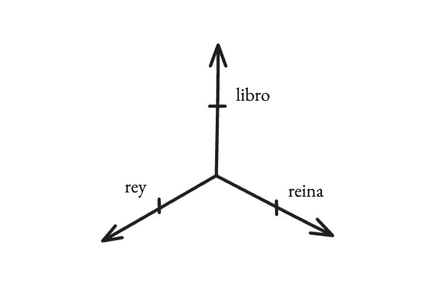

# Parte 3: Embeddings - dando significado a los tokens.

En el episodio anterior, dimos el primer paso fundamental para que nuestro pequeño GPT, sancho-mini, pudiera empezar a trabajar con el lenguaje de Cervantes: convertimos el texto en números, en tokens, y ahora tenemos secuencias como `[23, 41, 38, 5]` para representar "Hola", pero si lo piensas, esto todavía siguen siendo solo números, no tienen ningún significado, nuestro modelo podrá leerlo, pero no entenderlo, no es suficiente.

Los números no tienen un significado intrínseco, no guardan ninguna relación entre ellos, y necesitamos una forma de darle a nuestro modelo esa intuición, ese sentido del significado y la relación que nosotros damos por sentada.

Aquí es donde entran los **embeddings**, así que vamos a dejar atrás los números enteros para ver el mundo de los decimales, y el de los **vectores**, ya que os habréis fijado en el título, embeddings, y estos son, en esencia, la traducción de un token desde un simple identificador numérico, como lo que hemos generado hasta ahora, a un punto en un mapa multidimensional de significados. 

 

  

<i>Embeddings de los colores RGB.</i>

 

Los embeddings habitan como en mapas de significado, donde los tokens similares acaban agrupados en las mismas zonas del mapa, mientras que los que no tienen nada que ver estarán en zonas completamente diferentes, por ejemplo, si of fijáis en la imagen superior, podréis ver que los colores similares ocupan regiones similares en espacio multidimensional definido arriba, los colores cercanos al rojo los podemos ver por la zona de la izquierda, los cercanos al azul cerca de la zona superior derecha, etc.

 

## El camino para llegar hasta los embeddings

Para que entiendas por qué estos vectores son una idea tan genial, vamos a recorrer rápidamente los intentos fallidos que nos llevaron hasta ellos, porque nos ayudarán a entender el problema de fondo.

**Intento #1: La Idea Obvia - "Un Cajón para Cada Palabra" (One-Hot Encoding)**

La primera idea, la más directa, es crear un diccionario gigante con todas las palabras de nuestro vocabulario y asignarle a cada una su propio "cajón" o dimensión, es decir, si nuestro vocabulario tiene 50.000 palabras, para representar la palabra "rey" (que es la 2.501ª de nuestro diccionario), crearíamos una lista de 50.000 ceros y pondríamos un `1` solo en la posición 2.501.

*   `rey` = `[0, 0, ..., 1, ..., 0, 0]` (un 1 en la posición 2.501)
*   `reina` = `[0, 0, ..., 1, ..., 0, 0]` (un 1 en la posición 2.502)
*   `libro` = `[0, ..., 1, ..., 0, 0, 0]` (un 1 en la posición 15.340)

El gran problema de esto es que, matemáticamente, todos estos "cajones" están exactamente a la misma distancia unos de otros, el sistema no tiene forma de saber que el cajón "rey" debería estar más cerca del cajón "reina" que del cajón "libro". 

Como podemos ver en la imagen inferior, para nuestro modelo, todas las palabras serían conceptos aislados e igualmente diferentes entre sí, lo que no cual no capturaría el significado, solo la identidad.

  

<i>Ejemplo simplificado de One-Hot-Encoding. </i>

 

**Intento #2: El Esfuerzo Humano - "El Árbol Genealógico de las Palabras" (WordNet)**

La siguiente idea fue algo mejor, (pero no mucho mejor tampoco), y consistió en que un grupo de lingüistas se sentara a construir a mano una red gigante de significados llamada WordNet, definiendo relaciones explícitas como que un "perro" es un tipo de "cánido", y un "cánido" es un tipo de "mamífero".

El problema es que este enfoque es demasiado rígido y es un trabajo manual infinito. ¿Cómo defines la relación sutil entre "rey" y "poder"? ¿O entre "agua" y "tristeza"? Sumado al problema de que el lenguaje cambia constantemente, y este sistema no puede aprender por sí mismo, ya que es manual.

  

<i>El concepto de perro en WordNet.</i>

 

## La Solución: usar vectores como un mapa de significados

Y así llegamos a la idea que finalmente arregla las cosas (de momento), y que es una idea simple: **el significado de una palabra no es lo que *es*, sino dónde *aparece***, es decir, las palabras que se usan en contextos similares tienen significados similares.

En lugar de definir las palabras, las dejamos que ellas mismas encuentren su lugar en un "mapa de significados", y la herramienta perfecta para esto son los vectores, porque un vector no es más que un conjunto de coordenadas. Igual que `(40.41, -3.70)` podrían ser las coordenadas de un lugar en un mapa 2D, un vector de embedding como `[0.8, -0.2, 0.9, ...]` son las coordenadas de una palabra en un mapa de significados de cientos de dimensiones.

Y esto es lo que nos da varias ventajas:

1.  **La Similitud es Proximidad:** Si las palabras "rey" y "reina" aparecen en contextos parecidos (cerca de palabras como "trono", "corona", "palacio"), el modelo aprenderá a colocarlas muy cerca en el mapa. "Patata", que aparece en otros contextos, estará en una región completamente diferente.
2.  **Las Relaciones son Direcciones:** Las direcciones en este mapa también tienen significado. El "camino" que te lleva del vector de *Hombre* al vector de *Rey* (que podría representar el concepto de "realeza masculina") es casi el mismo camino que te lleva de *Mujer* a *Reina*. Por eso funciona la famosa ecuación: `Vector('Rey') - Vector('Hombre') + Vector('Mujer') ≈ Vector('Reina')`. Estamos haciendo álgebra con significados.
3.  **Aprenden Automáticamente del Contexto:** Nadie le dice al modelo qué significa "rey", el modelo simplemente lee miles de millones de frases y, a través del entrenamiento, va ajustando las coordenadas de cada palabra hasta que el mapa tiene sentido y le ayuda a cumplir su objetivo, que como ya sabemos, es predecir la siguiente palabra.

  

<i>Las direccinoes tienen significado.</i>

 

## Pero nos falta algo, ¿no?

Ya tenemos un mapa de significados, pero algo vital para entender el significado de cualquier frase, es comprender el orden de los términos que la conforman, por ejemplo "El Husky persigue al Akita" y "El Akita persigue al Husky", usan las mismas palabras, pero el orden de las palabras cambia totalmente el significado de cada una de las frases, necesitamos una forma de también darle esta información a nuestro modelo, y lo hacemos con otro tipo de Embeddings, llamados los **Positional Embeddings**.

La idea es simple: vamos a crear un segundo vector para cada token de la secuencia, pero esta vez el vector no representará el significado de la palabra, sino su posición (el primer token, el segundo, el tercero, etc.). Luego, simplemente **sumaremos** el vector de significado con el vector de posición.

`vector_final = vector_de_significado + vector_de_posición`

¿Y Por qué sumarlos y no multiplicarlos o concatenarlos? Pues porque la suma es como coger el punto de "Husky" en nuestro mapa de significados y desplazarlo un poquito en una dirección concreta que significa "estoy al principio de la frase". Así, el vector "Husky" al principio de una frase será ligeramente distinto al vector "Husky" en mitad de una frase, dándole a la red la pista que necesita para entender el orden sin destruir el significado original.

  

<i>El vector de Husky es alterado para representar mejor su significado con su posición.</i>

 

Estos vectores de posición también se aprenden durante el entrenamiento, exactamente igual que los de significado, el modelo empieza con vectores aleatorios para la posición 0, la 1, la 2, etc., y poco a poco aprende las mejores coordenadas para cada posición que le ayuden a predecir la siguiente palabra.

## ¿Y cómo aprende nuestro modelo todo esto?

Lo mejor de todo, es que no entrenamos los embeddings por un lado y el resto del modelo por otro, todo es parte de la misma red y parte del mismo entrenamiento.

Cuando empecemos a entrenar a sancho-mini, tanto la tabla de embeddings de caracteres como la tabla de embeddings de posición son solo matrices gigantes llenas de números aleatorios, el modelo las usa, procesa la información a través de sus capas, y hace una predicción sobre cuál será el siguiente carácter. Al principio, su predicción será malísima.

Pero calculando el error (la "loss") y usando un algoritmo llamado retropropagación (backpropagation) para enviar una señal de error hacia atrás a través de toda la red. Esta señal le dice a cada número en cada matriz (a cada "peso") cómo debería cambiar para que la próxima vez el error sea un poquito más pequeño. Si ajustar un valor en el vector de 'q' o en el vector de la 'posición 15' ayuda a predecir mejor una 'u' después, el optimizador lo hará.

Repite este proceso millones de veces, y lo que empieza como un caos de números aleatorios se organiza mágicamente en ese mapa coherente de significados y posiciones que le da al GPT la capacidad de asignar significado.

**Google Collab: Construyendo mapas de significados**

Google Collab: https://colab.research.google.com/drive/17dehMZD4q-sbGSX6ejNT_nI3qrf16TM2?usp=sharing