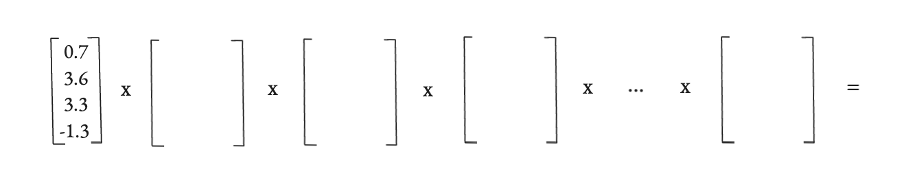
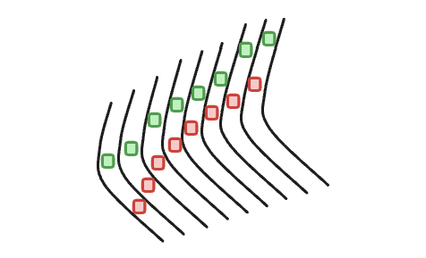
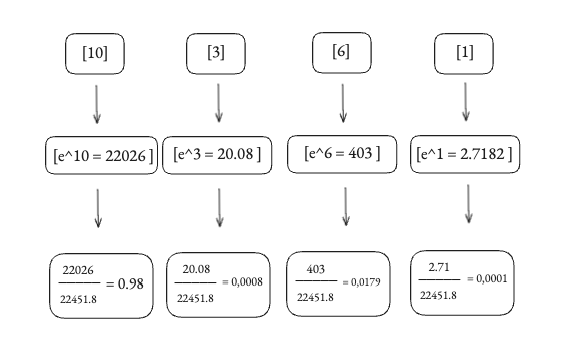

# Parte 4: Layer Norm

Ya hemos conseguido darle a `sancho-mini` un vocabulario a través de los tokens, e incluso sabemos cómo transformar esos tokens en vectores numéricos que dan significado con los embeddings.

Pero ahora, tenemos delante un problema que puede que a primera vista no se vea, pero que nos trae trabajar con valores decimales en un entorno algo impredecible: la inestabilidad.

Solo pensad en el viaje que hace un solo token dentro de nuestro GPT, desde que entra como un embedding hasta que sale como una predicción de la siguiente palabra, su información es transformada en **25 multiplicaciones de matrices** apiladas una detrás de otra, y cada una de estas multiplicaciones es una oportunidad para que tanto la escala de los números que representan esa información como sus propiedades estadísticas se descontrolen por completo.

Poniendo un ejemplo extremo, si en cada paso multiplicamos los números por, digamos, 1.5, al cabo de 25 pasos tendremos un número astronómico. Y si los multiplicamos por 0.5, al final no quedará prácticamente nada, se habrán desvanecido. Y lo que suele ocurrir, es que si no estabilizamos de alguna forma esto, el entrenamiento de nuestro GPT se vuelve menos eficaz, y más lento.

  

<i>Muchas multiplicaciones matriciales, muchas oportunidades de que perdamos estabilidad.</i>

 

Y bueno, el caos que puede surgir de esto se llama: **Internal Covariate Shift**.

## El Problema: Una Carrera de Relevos Caótica

**Internal Covariate Shift** puede sonar intimidante, pero imagina que entrenar a nuestra red neuronal es como entrenar a un equipo para una **carrera de relevos**.

*   Cada capa de nuestra red es un corredor.
*   El "testigo" que se pasan son los embeddings de cada uno de nuestros tokens.

El objetivo es que cada corredor (capa) aprenda a ser lo más eficiente posible (correr correctamente, y pasar el testigo correctamente), pero aquí es donde surge un problema: todos los corredores están aprendiendo y por ende cambiando su estilo al mismo tiempo, están aprendiendo de algo cambiante.

Imagina al corredor número 2:

1.  **En el primer intento**, el corredor 1 es un novato, corre lento y le pasa el testigo muy bajo, por lo que el corredor 2 aprende que, para ser eficiente, tiene que agacharse mucho para recoger el testigo.
2.  **En el segundo intento**, el corredor 1 ha mejorado un poco, ahora corre más rápido y pasa el testigo a una altura media, pero qué gracia es esta, porque el corredor 2 había aprendido a recoger el testigo bajo, por lo que falla estrepitosamente y tiene que volver a aprender.
3.  **En el tercer intento**, el corredor 1 es ya un cohete y pasa el testigo altísimo, de nuevo, la técnica del corredor 2 no sirve para nada.

Esto es el ***Internal Covariate Shift***: cada capa intenta aprender sobre un terreno (los datos que le llegan de la capa anterior) que no para de moverse, se transforma en un entrenamiento lento e inestable, donde cada capa trata de apuntar a un objetivo en constante movimiento (problemas).

  

<i>Como una carrera de relevos</i>

 

## ¿Y por qué es tan grave este caos?

Hemos visto que los números se descontrolan, pero vamos a ver ahora qué es exactamente lo que se rompe en nuestro proceso de aprendizaje, y son dos cosas. 

**1. El Gradiente se Vuelve Loco**

Nuestro modelo aprende con un proceso llamado Descenso de Gradiente (Gradient Descent), si entrenar un modelo fuese como aprender a aparcar, el gradiente sería el instructor que le diría a nuestro GPT "gira un poco el volante y acelera suavemente".

Si los valores de la red no son estables, o no tienen los valores que deberían de tener, el gradiente que se calcula también será más inestable, como un instructor que en vez de decirte "acelera suavemente", te dice **písale a fondo**.

El GPT da un acelerón que no debería, se pasa el sitio de aparcamiento y, en la siguiente iteración, el error no ha mejorado todo lo que podría mejorar. 

 

**2. La Atención No Funciona Como Debería**

Hay un segundo problema, que todavía no tenéis que entender del todo, de hecho seguro que lo entenderéis incluso aún mejor en la siguiente sección, y está localizado en algo llamado la capa de atención, por así decirlo como el corazón de nuestro GPT, donde usamos una función que llamamos **Softmax**, que nos ayuda a ver a qué palabras deberíamos de prestarle más atención en el texto, antes de generar nuestro siguiente token en la secuencia.

Recomiendo ver el vídeo para esta parte, porque muestro lo que ocurre con esta función de la que tanto dependemos, si tenemos valores internamente no estabilizados, y es que se trata de una función exponencial, por lo que si introducimos valores cada vez más grandes por ejemplo, estos pueden hasta llegar a llevarse el **100% de la atención**. Lo cual nos haría perder la capacidad de combinar el contexto, y básicamente el mecanismo que hace tan potentes a los Transformers se rompería.

  

<i>Solo con un valor como 10, a pesar de tener otros como 6, o 3, el token equivalente al logit de 10 monopolizaría toda la atención, llevándose el 98% de esta, esto no es bueno.</i>

 

## La Solución: LayerNorm, el Estabilizador

Para evitar este desastre, necesitamos una forma de "fijar el blanco" para cada corredor, es decir, de decirles algo como, el relevo entrégalo siempre a una altura media, y para conseguir algo así es donde usamos **Layer Normalization** o **LayerNorm**.

LayerNorm es como un gran estabilizador, para cada token, coge su vector y lo "aplana" sin destruir su información, haciendo de esta forma a que sus valores tengan siempre una escala predecible y manejable.

Vamos a ver cómo lo hace, paso a paso, con un ejemplo sencillo, imaginando que la dimensionalidad de nuestro modelo es 4, y el vector para el token "hidalgo" después de los embeddings es:

`x = [1.0, 0.0, -3.0, 4.0]`

**Paso 1: Calculamos la Media (μ)**

Primero, encontramos el "centro de gravedad" de nuestros números.

*   **Cálculo:** `(1.0 + 0.0 - 3.0 + 4.0) / 4 = 2.0 / 4 = 0.5`
*   **Resultado:** `μ = 0.5`

**Paso 2: Calculamos la Varianza (σ²)**

Ahora medimos cómo de dispersos están los números respecto a esa media de 0.5, y para ello, calculamos la media de las distancias al cuadrado.

*   **Cálculo:** `((1.0-0.5)² + (0.0-0.5)² + (-3.0-0.5)² + (4.0-0.5)²) / 4 = (0.25 + 0.25 + 12.25 + 12.25) / 4 = 6.25`
*   **Resultado:** `σ² = 6.25`
*   Y la desviación estándar (σ) es la raíz cuadrada: `σ = √6.25 = 2.5`

**Paso 3: Normalizamos el vector**

Con la media (0.5) y la desviación estándar (2.5), podemos "aplanar" nuestro vector original, la fórmula sería `(valor - μ) / σ`.

*   **Cálculo:**
    *   `(1.0 - 0.5) / 2.5 = 0.2`
    *   `(0.0 - 0.5) / 2.5 = -0.2`
    *   `(-3.0 - 0.5) / 2.5 = -1.4`
    *   `(4.0 - 0.5) / 2.5 = 1.4`
*   **Nuestro vector normalizado:** `x_normalizado = [0.2, -0.2, -1.4, 1.4]`

Fijaos qué maravilla: si ahora calculáis la media de este nuevo vector, os dará 0, y su desviación estándar será 1. Lo hemos estabilizado por completo.

**Paso 4: Devolver el Control al Modelo (con γ y β)**

Aunque bueno, aplicando una formula así, de forma prefijada, puede que hayamos sido un poco restrictivos, por lo que ahora le devolvemos el control al modelo usando dos vectores de parámetros que el modelo puede aprender durante el entrenamiento: **gamma (γ)** para re-escalar y **beta (β)** para desplazar.

Supongamos que el modelo ha aprendido que los valores óptimos son:

*   `gamma (γ) = [2.0, 1.0, 0.5, 1.0]`
*   `beta (β) = [0.1, 0.2, 0.3, 0.4]`

La operación final es `(x_normalizado * γ) + β`.

*   **Cálculo:**
    *   `(0.2 * 2.0) + 0.1 = 0.5`
    *   `(-0.2 * 1.0) + 0.2 = 0.0`
    *   `(-1.4 * 0.5) + 0.3 = -0.4`
    *   `(1.4 * 1.0) + 0.4 = 1.8`
*   **El resultado final de la capa LayerNorm es:** `y = [0.5, 0.0, -0.4, 1.8]`

Y este vector `y`, estabilizado pero recalibrado, es el que realmente pasará a la siguiente capa, la de Self-Attention, asegurando que el entrenamiento sea suave y estable, pero las capas LayerNorm no solo las usaremos antes de la primera capa de atención, será un recurso que usaremos constantemente a lo largo de nuestro GPT.

## Añadiendo LayerNorm a `sancho-mini`

Google Collab: 