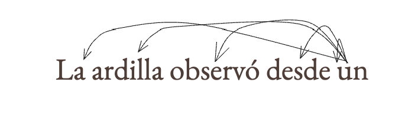
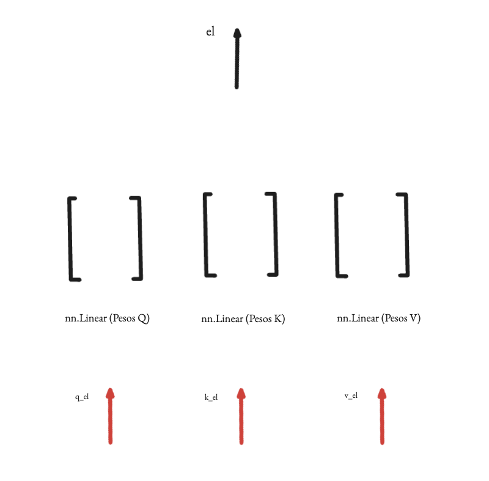
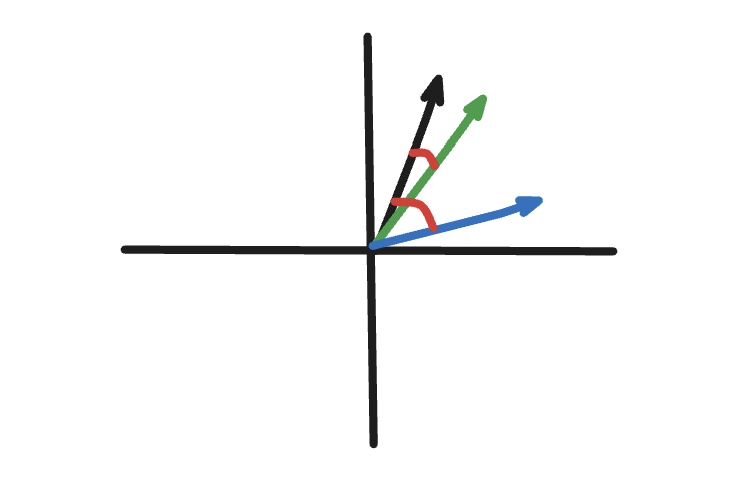
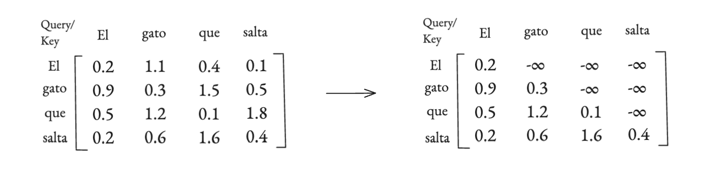
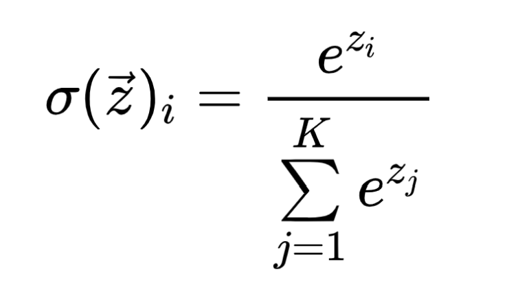
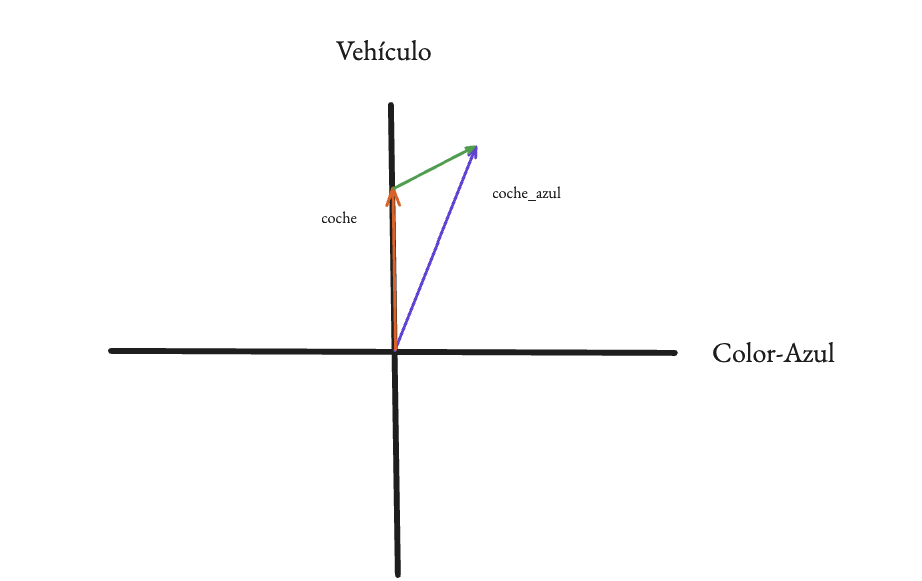
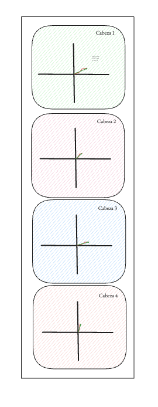

# Parte 5: Self-Attention

Bueno, ya hemos visto cómo un GPT entienda los caracteres, como números y que cada uno de esos números tiene una representación rica en significado con los embeddings, pero ahora nos enfrentamos a nuestro siguiente muro, y es que estos vectores normalizados de embeddings, no se hablan entre sí, viven aislados en islas de significado, y para generar texto, queremos entender todo el significado a la vez, ¿no?

<p align="center">
  
</p>
<p align="center"><i>Nuestro reto: entender todo el contexto a la vez, para poder escribir el siguiente token.</i></p>

Básicamente lo que necesitamos es un mecanismo para que los tokens puedan "mirarse" unos a otros, que puedan comunicarse y entender qué otros tokens de la secuencia son importantes para definir su propio significado en ese contexto concreto, y también para almacenar en nuestro último vector todo el contexto que necesitamos para hacer una buena predicción de cuál será el próximo token a añadir en nuestra secuencia. 

Y bueno, esta genialidad de la atención, fue introducida en 2014, por un paper del que no se habla mucho, del cual hablo un poco más en el vídeo si os interesa, pero el paper que ya formalizó esto de prestar atención a todo el contexto a la vez como la solución definitiva al problema de la traducción (del cual también hablo en el vídeo) es, ***Attention Is All You Need*** y bueno, esta sección es justo para hablar de eso, de la atención (o self-attention).

## La idea de la Atención

Para entender la atención usaremos aquí una analogía muy similar a la que propongo en el vídeo, que bueno, no es esa la primera vez que la uso, la usé también en mi review del paper original de la atención de 2014, pero bueno, imagina que cada token de nuestra secuencia es una persona en una biblioteca muy ruidosa, y cada persona (token) necesita encontrar información para entender mejor su propio propósito en la frase.

Como no pueden gritar, tienen este sistema para comunicarse:

1.  **La Pregunta (Query):** Cada token tiene una pregunta, algo que está buscando activamente, por ejemplo, el token "lo" en la frase "el perro persiguió al gato y *lo* atrapó" podría estar preguntando: "¿A quién me estoy refiriendo?". Esta es su **Query (Q)**.

2.  **La Etiqueta (Key):** Para ayudar a los demás, cada token también lleva una etiqueta colgada que resume de qué va, el token "gato" podría tener una etiqueta que dice "soy un sustantivo, animal, masculino, singular", esta es su **Key (K)**.

3.  **La Información (Value):** Finalmente, si alguien considera que la etiqueta de un token es relevante para su pregunta, puede pedirle la información completa que tiene, para el token "gato", esta información sería algo similar como a su propio embedding, como su propio significado contextual, este es su **Value (V)**.

El mecanismo de Self-Attention no es más que formalizar este proceso: cada token de nuestra secuencia emitirá una Query, una Key y un Value a partir de su propio embedding.

<p align="center">
  
</p>
<p align="center"><i>Producimos los vectores k,q y v</i></p>


## Calculando la "afinidad": el producto escalar

Una vez tenemos nuestras preguntas (q), etiquetas (k) y valores (v), lo primero es preguntarnos cómo sabemos si una etiqueta (k) promete para resolver nuestra pregunta (q).

Pues como son vectores, podemos usar una operación matemática que ya conocemos, el **producto escalar**, cuando multipliquemos el vector Query de un token por el vector Key de otro, el resultado (un simple número) nos dice cómo de "alineados" o "similares" son, es decir, si fuese una biblioteca y el título de cada libro fuese la key (k), estaríamos comprobando si creemos que el título nos ayudará a resolver nuestra duda (q).

*   Un número alto significa que la Key responde correctamente a la pregunta (Query)".
*   Un número bajo significa que no responde a la query.

Lo que haremos será que cada token calcule este producto escalar de su Query con la Key de ***todos*** los demás tokens de la secuencia (incluido él mismo), para obtener un resultado que será una matriz de puntuaciones, o `wei` (de *weights*, pesos), donde cada fila representa un token y cada columna nos dice la "afinidad" que ese token tiene con todos los demás.

<p align="center">
  
</p>
<p align="center"><i>Producto escalar entre el vector verde y el negro (resultado mayor, más similares), y entre el vector azul y el negro (resultado menor, menos similares).</i></p>

<br>

Ahora, solo hay dos pequeños detalles técnicos que ajustar a estas puntuaciones:

1.  **Escalado:** Estos productos escalares pueden dar números muy grandes, lo que puede causar problemas a la hora de entrenar la red neuronal (lo que se conoce como gradientes inestables). Para evitarlo, los autores del paper original descubrieron que dividir todas las puntuaciones por la raíz cuadrada de la dimensión de nuestros vectores Key y Query ayuda a mantener todo bajo control.
2.  **Enmascaramiento (Causalidad):** Y aquí llega un punto clave para un GPT, el modelo es un generador de texto, va a escribir palabra por palabra, por lo que un token no puede obtener información de los tokens que todavía no se han escrito, sería como hacer trampa, por lo que para evitar que los tokens "vean el futuro", aplicaremos una máscara a nuestra matriz de atención, poniendo un valor de infinito negativo (`-inf`) en todas las posiciones que representan conexiones futuras.

<br>

<p align="center">
  
</p>
<p align="center"><i>Enmascarado de una matriz.</i></p>

<br>


## De puntuaciones a porcentajes: Softmax

Bueno, ya tenemos una matriz de puntuaciones, con el futuro enmascarado, pero estos números son difíciles de interpretar, lo que queremos es convertir estas puntuaciones en porcentajes claros, algo que nos diga: "el token 'el' debería prestar un 80% de su atención al token 'gato', un 15% a 'persiguió' y un 5% a 'a'.

Para esto usamos una función que vimos en la anterior parte, llamada **Softmax**, que básicamente coge nuestra fila de puntuaciones y la transforma en una fila de números que suman exactamente 1 (es decir, un 100%). La genialidad es que, cuando Softmax ve el `-inf` que pusimos en el futuro, automáticamente lo convierte en un 0, asegurando que el modelo no preste absolutamente nada de atención a los tokens que no debe ver.

<br>

<p align="center">
  
</p>
<p align="center"><i>Función Softmax</i></p>

<br>

## El resultado final: la suma ponderada

Ahora que tenemos los porcentajes de atención podemos usarlos para crear una nueva representación para cada token, una que contenga el contexto adecuado que nos indique la matriz de atención.

Lo que hacemos es multiplicar esos porcentajes de atención por los vectores **Value (V)** de los otros tokens.

Es decir, el nuevo vector para el token "lo" será:
(80% del **Value** de "gato") + (15% del **Value** de "persiguió") + (5% del **Value** de "lo") + ...

El resultado final, `out`, es un nuevo vector para cada token de la secuencia, pero esta vez no es su embedding original y aislado, sino una mezcla, una combinación inteligente de sí mismo y de la información de los tokens a los que ha decidido prestar atención.

El token ha hablado con sus vecinos y ahora tiene una comprensión mucho más profunda de su lugar en la frase.

<br>

<p align="center">
  
</p>
<p align="center"><i>Vector final con contexto extra. (coche + azul -> coche_azul)</i></p>

<br>

## De un solo experto a varios: Multi-Head Attention

Lo que acabamos de describir ha ocurrido todo dentro de una sola **cabeza de atención** (Head), que es como tener a un único experto analizando las relaciones en la frase.

Pero el lenguaje es complejo, hay relaciones sintácticas, semánticas, de estilo, así que por qué no montamos un comité de expertos, donde cada uno se especialice en un tipo diferente de relación.

Que bueno, esta es la idea detrás de **Multi-Head Self-Attention**, que para poder hacerlo correctamente debemos dividir nuestro embedding en trozos más pequeños y ejecutar varias cabezas de atención en paralelo, cada una en cada uno de estos trozos, y también cada una con sus propias Queries, Keys y Values.

*   Una cabeza podría aprender a conectar verbos con sus sujetos.
*   Otra podría conectar adjetivos con los sustantivos que describen.
*   Otra podría detectar el inicio y el final de una cita.
*   etc

Y al final, como si se tratase de un trabajo en grupo en el que se ha dividido la labor entre sus integrantes, simplemente concatenamos los resultados de todas estas cabezas expertas y los pasamos por una capa lineal final para unificarlos, como cuando en un trabajo en grupo se junta todo el mundo al final para redactar el documento final a entregar, pues esto es lo mismo, y le da al modelo una muy buena capacidad para capturar una gran riqueza de relaciones contextuales.

<br>

<p align="center">
  
</p>
<p align="center"><i>Cada cabeza con sus propios resultados, esta imagen muestra justo el paso anterior a que sean unificadas por la capa de proyección.</i></p>

<br>

## Construyendo nuestra propia cabeza de atención

Ahora que entendemos la teoría, vamos a plasmarla en código dentro de nuestro Google Collab, me podréis ver en el vídeo comentando el proceso, pero resumido por aquí primero construimos una sola `Head` y luego usaremos varias para crear nuestro `MultiHeadAttention`.

Lo primero es el esqueleto de la clase:

```python
class Head(nn.Module):
    """ Una cabeza de self-attention """
    def __init__(self, head_size):
        super().__init__()
        pass

    def forward(self, x):
        pass
```

**Paso 1: Inicializando nuestras capas (el `__init__`)**

Dentro de `__init__`, necesitamos crear las tres capas lineales que transformarán los embeddings de entrada en los vectores Query, Key y Value, y también crearemos la máscara triangular como un `buffer`, que es una parte del estado del módulo que no se considera un parámetro a entrenar.

```python
# Dentro de __init__
self.key = nn.Linear(n_embd, head_size, bias=False)
self.query = nn.Linear(n_embd, head_size, bias=False)
self.value = nn.Linear(n_embd, head_size, bias=False)
self.register_buffer('tril', torch.tril(torch.ones(block_size, block_size)))
```

**Paso 2: Implementando la lógica (el `forward`)**

Ahora, en la función `forward`, seguimos paso a paso el proceso que describimos antes.

```python
# Dentro de forward
B, T, C = x.shape
k = self.key(x)   
q = self.query(x) 

# Calculamos las puntuaciones de atención usando la fórmula de atención
wei = q @ k.transpose(-2, -1) * C**-0.5 

# Aplicamos el enmascariamiento
wei = wei.masked_fill(self.tril[:T, :T] == 0, float('-inf'))

# Aplicamos softmax
wei = F.softmax(wei, dim=-1)

# Obtenemos el resultado final ponderando los Values
v = self.value(x) 
out = wei @ v     

return out
```

Y ya estaría, con esto hemos construido el corazón de nuestro GPT, el mecanismo que le permite al modelo empezar a entender el contexto, y a convertir secuencias de caracteres en la escritura de Cervantes. Y bueno ahora solo nos quedaría apilar varios de estos bloques de atención para darle a sancho-mini la profundidad que necesita para pensar (y otras partes del GPT que veremos ahora).