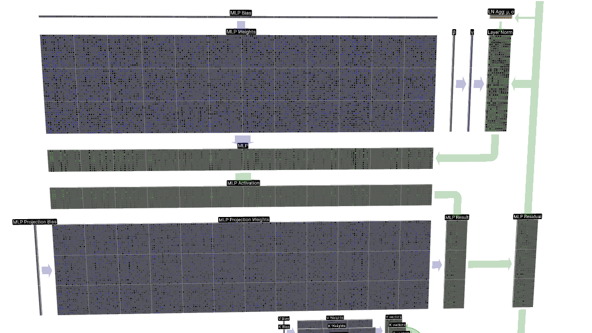

# Parte 6: MLP

Hasta ahora, en nuestro proceso para construir a `sancho-mini`, hemos creado la pieza más clave, la capa de self-attention, pero una vez que cada token ha escuchado a los demás y ha recogido toda la información relevante, necesita un momento a solas, un espacio para procesar todo lo que ha aprendido, para 'pensar' y refinar su propia identidad a la luz de ese nuevo contexto. La atención es fantástica moviendo información de un lado a otro, pero no es muy buena haciendo cálculos complejos sobre la información de cada token por separado.

Aquí es donde entra la segunda pieza de cualquier bloque de Transformer para un GPT: la **capa Feed-Forward** (también conocida como MLP o Multi-Layer Perceptron), que tiene el objetivo de añadir no linealidad y procesar aún más nuestra matriz. 

<p align="center">
  
</p>
<p align="center"><i>Sección de MLP.</i></p>

<br>


## La analogía del taller del especialista

Imaginaos la siguiente analogía, nuestro GPT es como un taller, y en la fase de atención tenemos como una fase de colaboración, donde cada vector o trabajador coge contexto o ideas de otros trabajadores, y después de esta fase inicial, cada trabajador entra en su propio taller para trabajar y refinar su  propia idea, lo que antes podía ser un vector, como por ejemplo en la frase "el coche azul rápido", "coche" que ahora sabe que está relacionado con "azul" y "rápido", entraría en el taller para convertirse en algo mucho más rico y específico.

Y este proceso de enriquecer sigue una serie de pasos:


**Paso 1: Expansión - Descomponiendo la idea en sus piezas**


Lo primero que hace nuestro especialista es coger la idea contextualizada y desmontarla en un montón de piezas mucho más pequeñas y específicas, si por ejemplo la idea fuese un motor, la expansión es el proceso de desmontarlo en tornillos, pistones, válvulas y cables para poder analizarlos todos por separado.

En nuestra red neuronal, esto lo hacemos con una capa lineal que expande la dimensión de nuestro vector, normalmente multiplicándola por cuatro, es decir, si nuestro vector de embedding (`n_embd`) tiene, por ejemplo, 32 dimensiones, lo proyectamos a un espacio mucho más grande de 128 dimensiones (`4 * n_embd`).

¿Por qué hacemos esto? Porque al darle más espacio, le damos al modelo la libertad de detectar combinaciones de características mucho más complejas y sutiles que estaban mezcladas en el espacio original.


<p align="center">
  
</p>
<p align="center"><i>n_embd * 4</i></p>

<br>


**Paso 2: La Activación no lineal (ReLU/GELU) - Decidiendo qué piezas son importantes**

Una vez que tenemos todas las piezas del motor sobre la mesa, nuestro especialista tiene que decidir con cuáles se queda, y claramente algunas serán muy importantes para la nueva idea que quiere construir, y otras serán irrelevantes o incluso contraproducentes.

Aquí es donde entra una función de activación no lineal como ReLU (Rectified Linear Unit) o como podría serlo también GELU. El trabajo que hacen es: mira el valor de cada una de esas 128 "piezas" o características que hemos detectado y, si el valor es negativo, lo convierte en cero, os lo podéis imaginar como un filtro, un interruptor que dice: "si esta característica no se ha activado con suficiente fuerza, la ignoramos por completo".

Sin este paso, toda nuestra red neuronal sería una simple sucesión de operaciones matemáticas lineales, y no podríamos aprender patrones muy complejos.

<p align="center">
  
</p>
<p align="center"><i>Igualando a 0 las características que no se activan con suficiente fuerza (ReLU), (GELU también es una opción, y permite algunos números negativos).</i></p>

<br>

**Paso 3: La Proyección - Reensamblar la idea**

Ahora que nuestro especialista ha filtrado y se ha quedado solo con las piezas más valiosas y prometedoras, es el momento de volver a montar el motor, pero esta vez de una forma más optimizada.

Para ello, usamos otra capa lineal, esta capa toma las 128 dimensiones filtradas y aprende la mejor manera de combinarlas para proyectarlas de vuelta al tamaño original de nuestro embedding (`n_embd`), es decir, a 32 dimensiones en nuestro ejemplo. Es un "reconstructor de significado" que coge los patrones activados y los condensa en una nueva representación del token, mucho más rica y sofisticada que la original.

<p align="center">
  
</p>
<p align="center"><i>El proceso de deconstrucción y construcción refinada de nuestro nuevo motor (el proceso a grandes rasgos que sigue una capa de MLP).</i></p>

<br>

## El código de la capa MLP

Bueno, hemos visto por encima la intuición así que ahora vamos a montar el código, que lo podréis ver mejor en el vídeo pero aquí os hago un resumen, debemos de construir la clase `FeedForward`:

```python
class FeedForward(nn.Module):
    """ Una red feed-forward simple seguida de una no-linealidad """

    def __init__(self, n_embd):
        super().__init__()
        self.net = nn.Sequential(
            # Proyectamos de n_embd a un espacio 4 veces mayor para "pensar"
            nn.Linear(n_embd, 4 * n_embd),

            # Aplicamos nuestro filtro para quedarnos con las características importantes, en este ejemplo una ReLU, servirá
            nn.ReLU(),

            # Volvemos a proyectar al tamaño original, creando una representación refinada
            nn.Linear(4 * n_embd, n_embd),
            
            # Un pequeño extra: Dropout para evitar que el modelo "memorice"
            # Durante el entrenamiento, apaga aleatoriamente algunas neuronas para hacerlo más robusto
            nn.Dropout(dropout),
        )

    def forward(self, x):
        return self.net(x)
```

## Uniendo todas las piezas del bloque Transformer

Y bueno, de esa forma ya tenemos nuestras dos piezas más importantes: la mesa de colaboración (Self-Attention) y el taller del especialista (Feed-Forward). Lo que nos quedarías es ensamblarlas en un único `Block` de Transformer, que es la unidad de construcción que repetiremos una y otra vez para crear el cerebro de `sancho-mini`.


```python
class Block(nn.Module):
    """ Un bloque de Transformer: comunicación seguida de computación """

    def __init__(self, n_embd, n_head):
        # n_embd: el tamaño de nuestro embedding
        # n_head: el número de cabezas de atención que queremos
        super().__init__()
        head_size = n_embd // n_head
        # Comunicación
        self.sa = MultiHeadAttention(n_head, head_size) 
        # Computación
        self.ffwd = FeedForward(n_embd) 
        # Añadimos algunas capas de LayerNorm para estabilizar el entrenamiento
        self.ln1 = nn.LayerNorm(n_embd)
        self.ln2 = nn.LayerNorm(n_embd)

    def forward(self, x):
        # El token 'x' se comunica con los demás y se actualiza, con conexión residual
        x = x + self.sa(self.ln1(x))

        # El token actualizado 'x' ahora entra en el taller de MLP
        # De nuevo, otra conexión residual
        x = x + self.ffwd(self.ln2(x))
        
        return x
```

Y ya estaría.

Hemos construido un bloque completo de Transformer, el corazón de nuestro GPT.

El siguiente paso será apilar varios de estos bloques, uno encima del otro, para crear una red profunda que permita a `sancho-mini` aprender patrones complejos, y bueno, también saber cómo generar un output final o cómo entrenar a nuestro GPT.