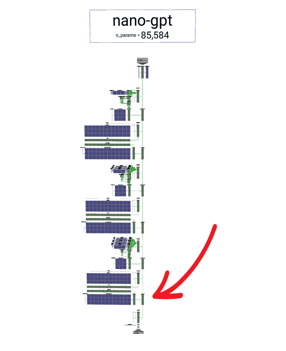
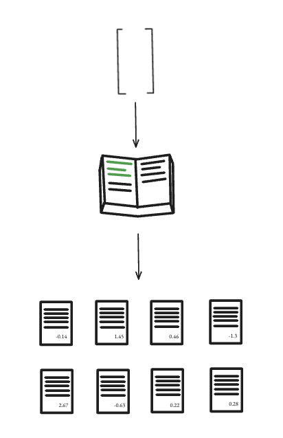

# Parte 7: Output

Nuestros tokens han entrado como si se tratasen de reclutas novatos, han sido enriquecidos con su posición, han pasado por múltiples bloques de entrenamiento intensivo donde han compartido contexto con sus compañeros a través de la auto-atención y han podido reflexionar sobre lo aprendido en sus capas MLP.

Y después de todo este proceso, finalmente llegamos al momento de la verdad, el único propósito para el que nuestro GPT, nuestro pequeño `sancho-mini`, ha sido diseñado: predecir cuál debe de ser el siguiente token a generar.

Piensa en el vector de salida del último token de nuestra secuencia. Si le hemos dado "El ingenioso hidalgo de la", nos vamos a fijar en el vector que corresponde a "la", ya que este vector ya no es un simple embedding, no, ahora contiene todo el contexto que necesitamos para hacer nuestra predicción del próximo token, por motivos educativos (no por precisión) le pondremos un nombre como, el **contenedor del contexto**.

  

<i>Aquí tenemos el vector que necesitamos, producto de todos los bloques de transformers.</i>

 

Este vector contiene toda la información y el significado de la secuencia que le precede, destilada y empaquetada en un formato numérico, perfectamente preparada para responder a la única pregunta que nos importa para generar texto: ¿qué token viene ahora?

Pero antes de poder hacer nuestra predicción hacen falta completar tres últimos pasos en su viaje: una estabilización final, un juicio y una traducción para que nosotros podamos entender el veredicto.

### Paso 1: La Estabilización Final (LayerNorm)

Justo antes de ver el resultado final, nuestro vector pasa por una última capa de `LayerNorm`, ya que un último paso de estandarización se asegura de que nuestro vector llegue con una media de cero y una varianza de uno, para que la siguiente capa, la más importante de todas, pueda hacer su trabajo de forma estable y sin sorpresas, es un simple paso de estabilización (como en muchos otros puntos de la arquitectura del GPT), pero crucial para que el resultado sea fiable.

### Paso 2: El Juicio Final (La Capa `Linear`)

Aquí es donde ocurre el paso más clave para hacer que sea posible saber cuál es verdaderamente la predicción del modelo, nuestro último vector, con todo el contexto que necesita y estandarizado, entra en una simple capa `nn.Linear` esta capa la podemos llamar LM Head.

Podemos pensar en esta capa como un diccionario final:

1.  **Nuestra palabra:** El vector que entra a esta capa es como el mejor indicador posible de cuál es la palabra que estamos buscando. No es la palabra en sí, claro, es un conjunto de características numéricas que definen el concepto de la siguiente palabra en ese contexto específico.

2.  **La LM Head, el "diccionario":** La matriz de pesos de esta capa `Linear` es, en esencia, un diccionario gigante. Tiene tantas filas como palabras hay en nuestro vocabulario, como si se tratase de un diccionario de verdad, y cada una de esas filas es como el "vector ideal" de cada palabra que `sancho-mini` conoce. El modelo ha aprendido estas definiciones oficiales de las palabras durante todo el entrenamiento.

Cuando nuestra "palabra" (el vector de entrada) pasa por la LM Head, lo que ocurre es una gigantesca rueda de reconocimiento, el sistema, mediante **producto escalar**, compara nuestra palabra con **todas y cada una** de las definiciones oficiales del diccionario.

 

  

<i>Como una consulta de diccionario.</i>

 

Y el resultado final de esa comparación masiva, es una puntuación de similitud entre nuestro vector final y cada una de las palabras de nuestro vocabulario, lo cual nos indica cuál es la predicción final de nuestro GPT sobre cuál debe de ser la siguiente palabra en generarse. 

Pero el resultado no es solo una cifra, es un nuevo vector, larguísimo, con una puntuación para cada palabra de nuestro vocabulario. y a este vector de puntuaciones en bruto para las predicciones lo llamamos **logits**.

### Paso 3: De Puntuaciones a Probabilidades (Softmax)

Ya casi estamos. Tenemos nuestros logits, un montón de números que nos dicen qué tan "afín" es cada palabra de nuestro vocabulario a ser la siguiente, pero estas puntuaciones son difíciles de interpretar, pueden ser positivas, negativas, grandes o pequeñas... no son muy intuitivas.

Necesitamos convertir este veredicto final en probabilidades finales, y para eso usamos la función **Softmax**, que ya sabemos cómo funciona llegados a este punto.

Y bueno, el resultado ya no sería un conjunto de puntuaciones raras, sino una **distribución de probabilidad** en toda regla.

Algo como:

*   "Hay un 75% de probabilidad de que la siguiente palabra sea 'gato'".
*   "Hay un 15% de probabilidad de que sea 'naranja'".
*   "Hay un 5% de probabilidad de que sea 'que'".
*   ...y así para todo el vocabulario.

## La Decisión Final: ¿Qué Token Elegimos?

Con esta lista de probabilidades, `sancho-mini` tiene todo lo que necesita para escoger el próximo token, o en este caso, caracter, el último paso sería simplemente elegir un token de la lista en base a las probabilidades.

La forma más simple, llamada **Búsqueda Codiciosa (Greedy Search)**, es elegir siempre la opción con la probabilidad más alta, si 'gato' tiene un 75%, pues elegimos 'gato' y punto, lo cual es efectivo, pero perderíamos mucha riqueza en casos donde el token a escoger no sea tan claro.

Una forma más interesante, es el **muestreo**, que es como tratar nuestra lista de probabilidades como una ruleta ponderada y la hacemos girar, 'gato' ocupará el 75% de la ruleta, así que es muy probable que salga, pero a veces, solo a veces, la ruleta caerá en 'naranja' o 'que', añadiendo esa chispa de variedad y creatividad que hace que el texto generado parezca más humano.

En el vídeo entro más en detalle sobre el muestreo, pero en cuanto a construir la estructura, ya estaríamos.

En las próximas partes vamos a ver cómo entrenar ahora a nuestro modelo y también cómo usarlo.