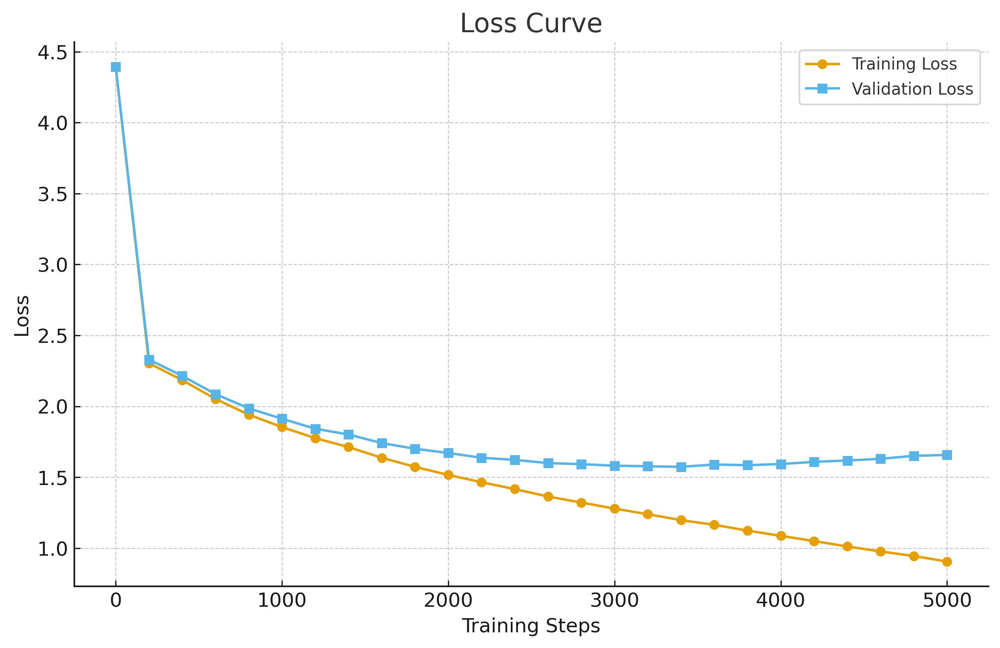
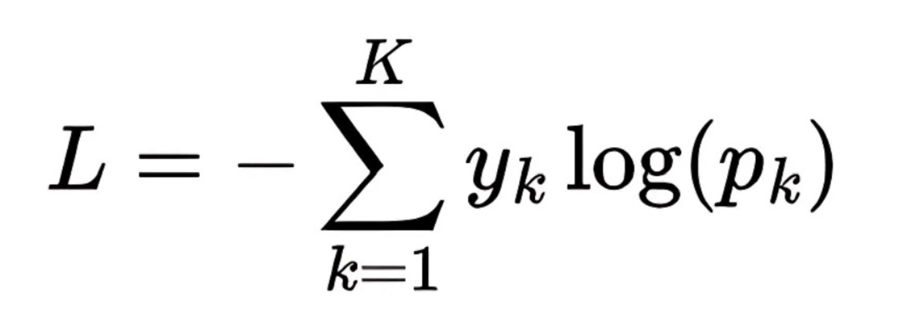

# Parte 8: Entrenamiento del Modelo

Después de haber construido toda la arquitectura de nuestro GPT, desde los embeddings hasta la salida final, llega el momento más importante y laborioso de todo el proceso, el entrenamiento, que es donde el modelo realmente aprende a predecir el siguiente token, y para ello necesitamos definir cómo va a aprender, qué significa “aprender” en este contexto y cómo evaluamos si está mejorando o no, así que vamos a desglosar este proceso paso a paso, empezando por la función de pérdida, que es el corazón de todo el aprendizaje automático.

  

<i>Curva de la loss durante el entrenamiento de sancho-mini</i>

## La función de pérdida: Cross Entropy Loss

El objetivo de nuestro modelo es que, dado un contexto, sea capaz de predecir el siguiente token con la mayor precisión posible, y para cuantificar qué tan lejos está de la predicción correcta, usamos una función matemática llamada función de pérdida, en nuestro caso la más habitual es la **Cross Entropy Loss**, que mide la diferencia entre la distribución de probabilidades que predice el modelo y la distribución real (donde la probabilidad correcta está toda en el token verdadero), y su fórmula, para un solo ejemplo, es:

  

<i>Fórmula de la Cross Entropy Loss, que mide la diferencia entre la predicción y la realidad.</i>

donde \(y_i\) es 1 solo para el token correcto y 0 para los demás, y \(p_i\) es la probabilidad que el modelo asigna a cada token, así que si el modelo acierta, la loss es baja, y si falla, la loss es alta, y durante el entrenamiento lo que buscamos es minimizar esta loss en todo el set de entrenamiento.

## Mean Loss y el proceso de optimización

Como no entrenamos con un solo ejemplo, sino con miles o millones, lo que hacemos es calcular la **mean loss** (la media de la loss) sobre un batch de ejemplos, y es este valor el que monitorizamos durante el entrenamiento, si la mean loss baja, el modelo está aprendiendo, si se estanca o sube, algo va mal, y aquí entra el proceso de optimización, que consiste en ajustar los parámetros del modelo para que la loss disminuya, y para ello necesitamos calcular cómo afecta cada parámetro a la loss, lo que nos lleva al cálculo de derivadas parciales.

## Derivadas parciales, regla de la cadena y backpropagation

El proceso de entrenamiento se basa en el cálculo de derivadas parciales de la loss respecto a cada uno de los millones de parámetros del modelo, y como la arquitectura es una composición de muchas funciones (capas), usamos la **regla de la cadena** para propagar el gradiente desde la salida hasta cada parámetro, este proceso se llama **backpropagation**, y es el que permite que el modelo sepa en qué dirección y cuánto debe ajustar cada peso para mejorar la predicción, así que en cada paso de entrenamiento, calculamos la loss, propagamos el gradiente hacia atrás y actualizamos los parámetros usando un **optimizer** (como Adam o SGD), que es el encargado de aplicar estos cambios de forma eficiente.

  

<i>Diagrama del proceso de backpropagation, mostrando cómo el gradiente fluye desde la loss hacia los parámetros.</i>

## Set de entrenamiento, set de validación y generalización

Para entrenar el modelo, dividimos nuestros datos en dos conjuntos: el **set de entrenamiento**, que es el que el modelo ve y usa para ajustar sus parámetros, y el **set de validación**, que es un conjunto aparte que nunca se usa para entrenar, solo para medir si el modelo está aprendiendo a generalizar o simplemente está memorizando, si la loss en el set de entrenamiento baja pero la loss en validación se mantiene alta o empieza a subir, significa que el modelo está sobreajustando (overfitting), es decir, ha memorizado los ejemplos pero no sabe generalizar a nuevos datos, y por eso monitorizamos ambas losses durante el entrenamiento.

  

<i>Curvas de loss de entrenamiento y validación, mostrando el punto donde empieza el sobreajuste.</i>

## Cuándo parar el entrenamiento

El entrenamiento se detiene cuando la loss de validación deja de mejorar durante un número determinado de pasos o épocas, lo que indica que el modelo ha llegado a su capacidad máxima de generalización para esos datos, y seguir entrenando solo aumentaría el sobreajuste, así que el criterio habitual es usar **early stopping**, que consiste en parar cuando la loss de validación no mejora tras varios intentos, guardando el modelo en el punto donde mejor generalizaba.

